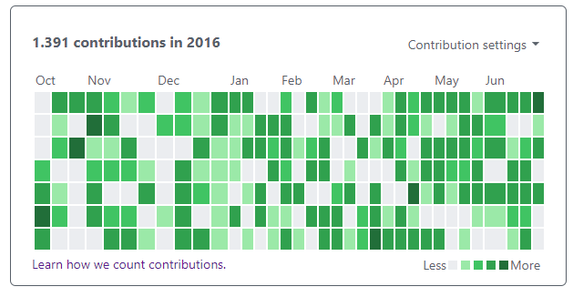

# Form react hooks formik

The objective about this project is create a github contribution table

## Required
[NodeJS v10.16.4 or higher](https://nodejs.org/en/)

## Installation
Open the terminal of your preference and input the commands:

`git clone https://github.com/danieladuarteng/github-contribution-table.git`

`cd github-contribution-table`

`npm install`

## Run:

To run the project enter:

`npm start`

## License

This project uses the license [MIT](https://choosealicense.com/licenses/mit/)
